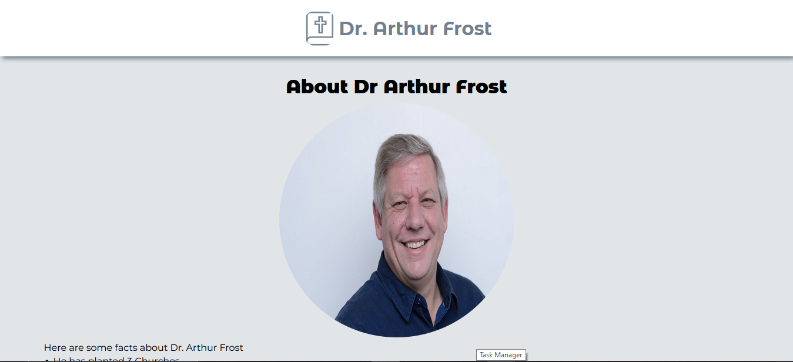

# Project Title

CRG Assessment - Dr. Arthur Frost Timeline

## Demo Link:

Access my site at https://59mrrobot.github.io/arthur-frost/

## About The App:

A single React page that displays the content of the JSON content retrieved via an Ajax call. 

https://arthurfrost.qflo.co.za/php/getTimeline.php

## Screenshots:

## Technologies:

- React
- Typescript
- HTML
- React Paginate

## Setup:

- Download or clone the repository.
- Install by running `npm install`.
- Start the server by running `npm start`.
- Visit the app at `http://localhost:3000/`.
